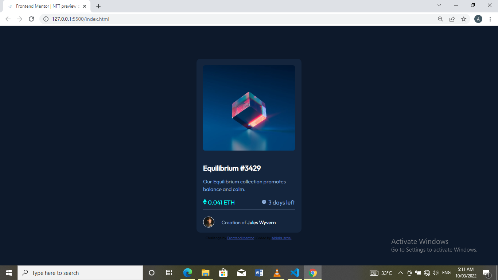

# Frontend Mentor - NFT preview card component solution

This is a solution to the [NFT preview card component challenge on Frontend Mentor](https://www.frontendmentor.io/challenges/nft-preview-card-component-SbdUL_w0U). Frontend Mentor challenges help you improve your coding skills by building realistic projects.

## Table of contents

- [Overview](#overview)

  - [Screenshot](#screenshot)
  - [Links](#links)

- [My process](#my-process)
  - [Built with](#built-with)
  - [What I learned](#what-i-learned)
  - [Continued development](#continued-development)
- [Author](#author)

## Overview

This project was done using HTML, CSS and Flexbox. I had to classify each sections into divs then work my way down. It took me about 3 hours for it to be completed. It allows the users to hover over the interactive elements specified in the style guide. I also maintained using @font face for the font while providing the directory to the font folder. I find the approach very easy.

### Screenshot

The link to the desktop screenshot can be seen above.

### Links

- Solution URL: [Add solution URL here](https://your-solution-url.com)
- Live Site URL: [Add live site URL here](https://your-live-site-url.com)

## My process

I built the project using

### Built with

- Semantic HTML5 markup
- CSS custom properties
- Flexbox

### What I learned

I learnt how to use the flexbox properties more on a project after a while. Viewing each layout as a flexbox makes things very easy. I am gaining more confidence with setting the active states of different elements.

### Continued development

I will take my time to learn more on CSS grid for bigger web layout and see how flexbox relates with it. Working these concepts will make things easy. I will love to learn more on hovering over images.

-

## Author

- Frontend Mentor - [@yourusername](https://www.frontendmentor.io/profile/Abiala705)
- Twitter - [@abiala_israel](https://www.twitter.com/abiala_israel)
